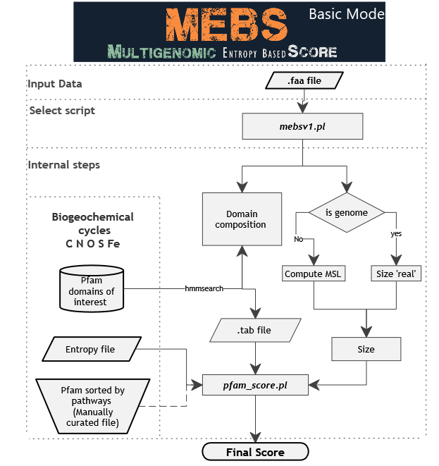
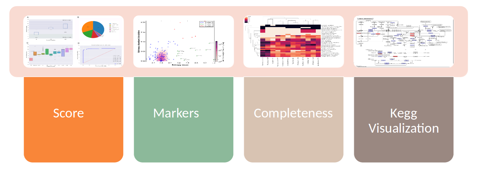

  


Authors: Valerie de Anda (1), Cesar Poot-Hernandez (2), Bruno Contreras-Moreira (3)

1. [Instituto de Ecologia](http://web.ecologia.unam.mx), UNAM, Mexico
2. [Instituto de Investigaciones Matematicas Aplicadas y en Sistemas](http://www.iimas.unam.mx), UNAM, Mexico
3. [Fundacion ARAID](http://www.araid.es) & [EEAD-CSIC](http://www.eead.csic.es), Zaragoza, Spain


# About MEBS

The main goal of MEBS is capture with a single value  the importance of complex metabolic pathways or biogeochemical cycles in a large omic datasets (either genomes or metagenomes). The algortithm has been thoroughly tested with the [sulfur cycle](https://academic.oup.com/gigascience/article/6/11/1/4561660), but currently other cycles are also supported. The script [mebsv1.pl](./mebsv1.pl) allows you to score your  own genome/metagenome in terms of biogeochemical cycles. 
All that is required is a directory containing peptide FASTA files of encoded proteins/fragments with **.faa** extension.
Note that [hmmsearch](http://hmmer.org/download.html) must be installed first.

# MEBS installation 

The MEBS software is available as an open-source package distributed from a GitHub repository. Thus,
the natural way of installing it is by cloning the repository via the following commands:

```
git clone https://github.com/eead-csic-compbio/metagenome_Pfam_score

#Alternatively, a ZIP file can be downloaded and then unpacked:

unzip metagenome_Pfam_score-master.zip
```

Have a look at the options of the main script mebsv1.pl


```
perl mebsv1.pl

  usage: mebsv1.pl [options] 

   -help    Brief help message
   
   -input   Folder containing FASTA peptide files (.faa)                  (required)

   -type    Nature of input sequences, either 'genomic' or 'metagenomic'  (required)

   -fdr     Score cycles with False Discovery Rate 0.1 0.01 0.001 0.0001  (optional, default=0.01)

   -cycles  Show currently supported biogeochemical cycles
```

## MEBS supported cycles

 The following biogeochemical cycles  are ready to use with MEBS:
 
1. [sulfur](./cycles/sulfur): Includes the  mobilization of inorganic and inorganic sulfur compounds
2. [carbon](./cycles/carbon):Usage of CH4 compounds  by methanotrophs, methanogens, and methylotrophs
3. [oxygen](./cles/oxygen): Represented by oxygenic photosynthesis
4. [iron](./cycles/iron): The Fe reduction and oxidation including also  siderophores uptake
5. [nitrogen](./cycles/nitrogen): We included the pathways involved in the reduction and oxidation of both inorganic (nitrate(+5) to ammonia(-3) ) and organic nitrogen compounds (i.e taurine, urea, and choline degradation)


```
perl mebsv1.pl -cycles
# Available cycles:
sulfur
carbon
oxygen
iron
nitrogen
```

## MEBS starting point 

MEBS assumes that your sequencing data is in fasta format  **(.faa)** extension in an especific directory.
Example of the input data can be foun in *test_genomes/* or *test_metagenomes/* directories

```
head  -3 test_genomes/*.faa 
==> test_genomes/Archaeoglobus_profundus_DSM_5631.faa <==
>WP_012766394.1 hypothetical protein [Archaeoglobus profundus]
MGSQEVGRIEEEVVEERRQEEEEIDEEEATGSALLTAEEFDKKIEEIKAKVREAVQEALANTLADLLEKEEKEEKRKDET
KAEELPKCPKNLSWLKKMFEILPLDILRNSKLWRYRHCVWALQEAEKEAEKFRNS

==> test_genomes/Enterococcus_durans.faa <==
>WP_000053907.1 MULTISPECIES: replication control protein PrgN [Bacilli]
MSLKNYVYSHPVNVFIIGRLGLSVEVFCELYGFKQGTLSSWVTREKTVASLPIEFLHGLSLASGETMDQVYDCLCVLEQE
YIEYKIANELRKRKKYIQ
```

# Running MEBS   

To run MEBS you only need to specifyt the input folder and the  type of data  (either genomic or metagenomic). The latter is  required for MEBS to allocate the  pre-computed entropies  for each type of data considering the fragmentary nature of the metagenomic sequences. 


### Genomic data 

```
perl mebsv1.pl  -input test_genomes/ -type genomic 
	   sulfur	carbon	oxygen	iron	nitrogen
Enterococcus_durans.faa	-0.063	0.284	0.883	0.214	3.044
Archaeoglobus_profundus_DSM_5631.faa	11.434*	24.834*	1.493	0.765	6.873
```

The scores that meets the criteria of specific  FDR  are shown in asterisc, yet the score will be the same regardless of the FDR that is used. If the Score if greater or equal to the FDR, then an asterisc  will be shown in the output. In the case of using the  default FDR (0.01), more false positive will be obtained, for example the genome *Archaeoglobus profundus* a well known microorgnism involved in the S-cycle, could seem to have a CH4 metabolism by using a default FDR,however if we increase to FDR 0.001, the C cycle asterisc is gone and only the  S-cycle ramain. Therefore,  we recomend a more restrictive FDR in order to eliminate false positives.


```
perl mebsv1.pl  -input test_genomes/ -type genomic -fdr 0.001

           sulfur       carbon  oxygen  iron    nitrogen
Enterococcus_durans.faa -0.063  0.284   0.883   0.214   3.044
Archaeoglobus_profundus_DSM_5631.faa    11.434	24.834* 1.493   0.765   6.873
```  

If you attempt to benchmark your own metabolism, we recomend to add your own FDR values in this [config file](./config.txt) at the end of this file. 
In a 16.04 Ubuntu system, 16Gb RAM, intel Inside i7 the time to run the scritpt  in the example folder is less than 20 seconds. 

```
real	0m14.183s
user	0m22.961s
sys	0m0.865s
```

In the case that you have several genomes (hundreds or thoundsands) that you wan to know wheter they are involved in certain metabolism  you just need to redirect the output in a tabular file.
We recomend to use screen or nohup if you're running MEBS in a server. 

```
perl mebsv1.pl  -input test_genomes/ -type genomic > test_genomes.tsv  &
less test_genomes.tsv
```


### Metagenomic data 
In the case of using metagenomic data metagenomic data the mean size length  (MSL) and the size of the allocated entropies  (MSLbin)  is especify as warning. If you redirect the output of the script to a file this information will not be printed. 


```
perl mebsv1.pl  -input test_genomes/ -type metagenomic

# Computing Mean Size Length (MSL) ...
# 4511045.3_metagenome.faa MSL=32 MSLbin=30
# 4440966.3_metagenome.faa MSL=175 MSLbin=150

	sulfur	carbon	oxygen	iron	nitrogen
4511045.3_metagenome.faa	-2.295	1.790	5.412	2.745	13.024
4440966.3_metagenome.faa	5.817*	8.804	1.178	4.579	11.697	   
```

As MEBS needs to compute the MSL of each metagenome the time will depend on the size of the input sample. In the test_metagenomes/ directory there are only two metagenomes with   size of  2,8M  and 6,5M respectively. The computation time will depend on the size and the number of metagenomes in the input forlder.  In the example it takes less than 40 seconds to finish.  


```
real	0m36.736s
user	1m40.328s
sys	0m2.599s
```

# Summary of MEBS basic mode 
Below we summarize the internal steps performed with MEBS in the basic mode using the main script [mebsv1.pl](./mebsv1.pl)




# Modalities 
Besides the score, the other modalities of MEBS are: 

1. **Score**: capturing the metabolic machinery of your genome or metagenome in terms of single scores (mebsv1.pl script)
2. **Markers**: Detect possible marker genes according to their informational content (entropy)
3. **Completeness**: Evaluate the metabolic completeness of metabolic pathways
4. **Kegg visualization**: Visualizate the protein domains in your genome or metagenome using KEGG visualization




# External dependencies for advance mode 

The following external packages are required if you want to benchmark your own metabolic pathway. 
Interproscan and hmmsearch are needed in order to annotate Pfam domains within peptide sequences.
The rest of packages are needed to run the full pipeline, which comprises four steps.

1. [Interproscan](https://www.ebi.ac.uk/interpro/interproscan.htm}{Interproscan)
2. [Python3](https://www.python.org/downloads)
3. [Matplotlib 1.4 or greater](http://matplotlib.org/users/installing.html#most-platforms-scientific-python-distributions)
4. [Numpy](https://docs.scipy.org/doc/numpy-1.10.0/user/install.html)
5. [Pandas](http://pandas.pydata.org/pandas-docs/stable/install.html)
6. [Scikit-learn](http://scikit-learn.org/stable/install.html)
7. [Jupyter-notebook](http://jupyter.org}{Jupyter-notebook)
8. [MPL_toolkits](http://matplotlib.org/1.4.3/mpl_toolkits/index.html)


# Scoring your data: Train your own classifier. Advanced Mode 

For more advanced users  a [manual](https://eead-csic-compbio.github.io/metagenome_Pfam_score/manual.v1.pdf) is provided. The required inpuft data are:

1. FASTA file with peptides sequences of proteins involved in the cycle/pathway of interest.
2. List of RefSeq accesions of (curated) genomes known to be involved in the cycle/pathway of interest.

These inputs are processed in order to train a classifier which internally uses [Pfam](http://pfam.xfam.org) domains.

As seen above, genomes or metagenomes provided by the user can then be scored with the trained classifier.
Once a classifier has been trained, such as the Sulfur cycle, steps 1 and 3 can be skipped.


# Manual and Readme 

Instructions and full documentation of MEBS are available on [html](https://eead-csic-compbio.github.io/metagenome_Pfam_score/READMEv1.html) and [pdf](https://eead-csic-compbio.github.io/metagenome_Pfam_score/manual.v1.pdf)


# Support and Development

Planned feature improvements are publicly catalogued at the main MEBS development site on github. Bug reports and problems using MEBS  are welcome on the [issues tracker](https://github.com/eead-csic-compbio/metagenome_Pfam_score/issues). We prefer posting to the issue tracker over email as these posts are searchable by other users who may experience the same problems.


# Links related to MEBS 

1. [Winner of the Bioinformatics Peer Prize II: student category ](https://the-bioinformatics-peer-prize-ii.thinkable.org/)
2. [Semifinalist of the GigaScience Prize Track ICG-12](http://www.eead.csic.es/compbio/pics/GigaSciencePrizeTrack.html)


# Cite us
If you find this software usefull please cite us as: 

+ De Anda V, Zapata-Penasco I, Poot Hernandez AC, Fruns LE, Contreras Moreira B, Souza V (2017) MEBS, a software platform to evaluate large (meta)genomic collections according to their metabolic machinery: unraveling the sulfur cycle. [doi:10.1093/gigascience/gigascience/gix096/4561660](https://academic.oup.com/gigascience/advance-article/doi/10.1093/gigascience/gix096/4561660)
<!--[doi:10.1101/191288 ](https://www.biorxiv.org/content/early/2017/09/20/191288)-->


