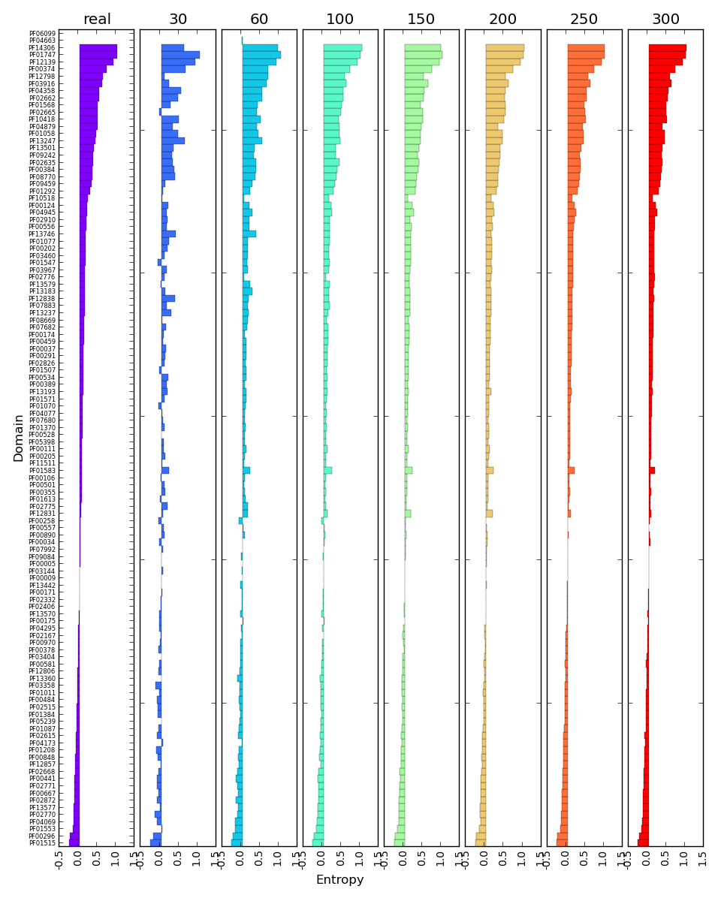

We share this computational approach (written in perl and python) to compute, at molecular level, sulfur cycle (SC) enrichment at multigenomic scale. We hope it can help other researchers. This piIn a nutshell, this pipeline first estimates the relative

It gathers taxa, genes, enzymatic classification (EC) numbers, as well as protein families involved in the SC to estimate their relative entropies and then generates a dimension-less Sulfur Score (SS), which allows evaluating the importance of the SC as well as its ecological weight in metagenomic sample. 
This algorithm can be used with sets of gene families from particular metabolic pathways to search specific ecological capabilities, belonging either to different habitats or biogeochemical cycles. 

The algoritm is divided in four stages:

### STAGE 1. Compilation of datasets and databases 

Source: [Stage1.txt](Stage1.txt)

a) Genes of metabolism of interest in this case our database is called SuCy  (Sulfur Cycle) that includes the bulk of genes involved in metabolic mobilization of sulfur compounds. 

b) List of non redundant  genomes involved in the mobilization of the metabolism of interest. In our casem werely on the the information on the  metabolic guilds found in microbial mats, and described in primary literature and manually curated databases (MetaCyc and KEGG)  (Caspi et al., 2012; Kanehisa and Goto, 2000), we generate a comprehensive list of all the genomes described as sulfur associate (SuLy), which currently contains n=156 completely sequenced prokariotes. In order define a microorganism as sulfur associated, we chose only those with experimental evidence of its physiology of the degradation, reduction, oxidation or disproportion or organic/inorganic sulfur compounds.

c) Random List (RList) is the list of randomly sampled genomes. In order to build negative control sets of organisms, not particularly enriched on metabolic preferences, 1000 random lists of species and strains from the Genomic dataset were drawn with the same number of microorganisms in SuLy (n=156).

d) Genomic dataset.  Due to the genomic redundancy in complete genomes deposited at the NCBI repository (2759 genomes at the moment of the analysis in July 2014), we decided to reduce the set of genomic data using a web-based tool that uses "genomic similarity scores" (Moreno-Hagelsieb, Wang, Walsh, & ElSherbiny, 2013), selecting threshold values of genomic similarity of 0.95 and 0.01 of DNA signature. With those, we obtain a list of identifiers belonging to 1528 non-redundant genomes, which were downloaded from ftp://ftp.ncbi.nlm.nih.gov 

e) Genomic dataset fragmented. Taking into account the fragmented nature of the metagenomes  the detection of a protein family in a genomic dataset does not necessarily suggest that the same family could be detected in a metagenomic dataset due to its fragmentary nature. In order to account for this, the amino acid FASTA-format files of non-redundant genomes were fragmented in different sizes (30, 60,100,150,200,250,300).

f) Metagenomic dataset  A set of 935 metagenomes available from MG-RAST (3.6) was downloaded from http://api.metagenomics.anl.gov/api.html. The distribution of fragment lengths within each metagenome was calculated with custom Perl scripts, observing that their sizes ranged from 30 to 300 amino acids. 

##STAGE 2. Annotating protein domains

Source: [Stage2.txt](Stage2.txt)

##STAGE 3. Estimating relative entropy of protein domains

Source: [Stage3.txt](Stage3.txt)

In order to get an idea of how protein families are represented in sulfur-related genomes, we used a derivative of the Kullback-Leibler divergence, also known as relative entropy, to measure the difference between two probability distributions P and Q. In this context P(i) represents the total number of occurrences of protein family i in sulfur-related genomes 
(observed frequency) and  Q(i) is the total number of occurrences of that family in the Genomic dataset (1528 genomes), which is the expected frequency.  

The relative entropy H then captures to what extent a family informs specifically about sulfur metabolism. H values close to 1 correspond to most informative families (enriched among sulfur-related genomes), whereas low values of H, close to cero, describe non-informative families. 

Since the relative entropy might be biased by the number of whole-genome sequenced sulfur microorganism (**SuLy**), we re-calculated H substituting SuLy with equally sized lists of random genomes (**Rlist**), expecting to obtain low information protein domains in the random test. 

With these procedures we evaluated the variation of relative entropy of each PFAM in order to short-list those that could be used as markers in metagenomic datasets regardless of the average fragment length, and to generate a measure to be used as a way to compare the importance of sulfur metabolisms in metagenomes derived from any environment. 

##STAGE 4. Sulfur Score (SS) and interpretation

Source: [Stage4.txt](Stage4.txt)

We propose to evaluate the SC in a quantitative and comparative way using one single value that we call Sulfur Score (SS). In this approach, information-rich (H’) protein families (114) will contribute to higher Sulfur Scores, whereas non-informative families will decrease it. 
 
Therefore, if we compare total Sulfur Scores across different metagenomic datasets, sampled from different environments, those wherein the mobilization of sulfur compounds is most significant, will have a high SS; in contrast, environments where the SC is marginal will have low SS scores. Using this approach we calculated SS in genomic and metagenomic datasets of different mean fragment length.
